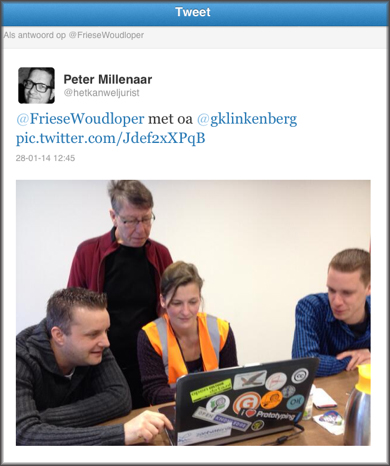
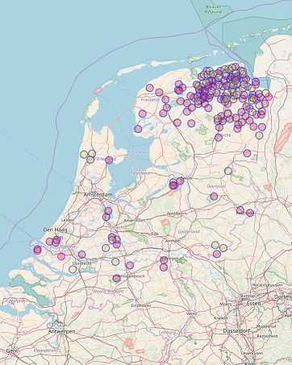

In 2014 kreeg de provincie Groningen het verzoek om gegevens over natuurijsbanen als open data beschikbaar te stellen. Helaas was dat niet mogelijk, omdat de provincie deze gegevens niet heeft. Toch wilden we de aanvrager niet in de kou laten staan. Er zijn zo veel mooie natuurijsbanen in Groningen, die moeten we toch op een kaartje kunnen plotten?!

We zijn toen een kleine crowdsourcing actie gestart en hebben met zijn allen binnen een paar weken alle Groninger natuurijsbanen ingetekend in [OpenStreetMap](https://nl.wikipedia.org/wiki/OpenStreetMap). Onze collega's komen uit de hele provincie, dus er was voldoende lokale kennis aanwezig :wink:

  
<small>Afbeelding 1: OpenStreetMap mini-mapathon bij de provincie, januari 2014 (foto: [@HetKanWelJurist](https://twitter.com/hetkanweljurist))</small>

De gegevens in OpenStreetMap zijn vrij beschikbaar. Je mag ze gebruiken voor je eigen kaarten en analyses, maar dan moet je niet vergeten om de juiste [naamsvermelding](http://www.openstreetmap.org/copyright) op te nemen.

De natuurijsbanen zijn door ons getagt met `"leisure"="ice_rink"` en `"seasonal"="yes"`. Ze zijn ingetekend als `node`, `way` of `relation`. Dat wil zeggen: punt, vlak of "donut" (een vlak met een gat in het midden). Je kunt het resultaat bekijken in [deze interactieve viewer](http://overpass-turbo.eu/map.html?Q=area%5B%22name%22%3D%22Nederland%22%5D%5B%22admin_level%22%3D%222%22%5D%20-%3E%20.n%3B%0A(%20%0A%20%20%20%20node%5B%22leisure%22%3D%22ice_rink%22%5D%5B%22seasonal%22%3D%22yes%22%5D(area.n)%3B%0A%20%20%20%20way%5B%22leisure%22%3D%22ice_rink%22%5D%5B%22seasonal%22%3D%22yes%22%5D(area.n)%3B%0A%20%20%20%20relation%5B%22leisure%22%3D%22ice_rink%22%5D%5B%22seasonal%22%3D%22yes%22%5D(area.n)%3B%0A)%3B%0Aout%20center%3B). Het duurt even voordat alle informatie is geladen.

We maken gebruik van de Overpass API om de gegevens weer uit OpenStreetMap te halen. Als je wilt weten hoe de Overpass API werkt, kun je bijvoorbeeld [deze tutorial](https://github.com/FrieseWoudloper/workshop-maptime2016-overpass) volgen.

  
<small>Afbeelding 2: Natuurijsbanen in Nederland, oktober 2017 (&copy; OpenStreetMap-auteurs)</small>